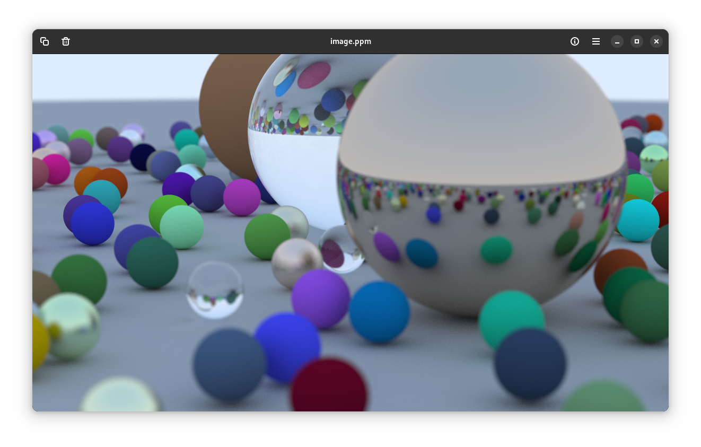

# BRaytraing - Basic Raytracing

Ref:- https://raytracing.github.io/books/RayTracingInOneWeekend.html#overview

Build cmd:
```sh
g++ -Wall -std=c++20 .\main.cpp
```

Run cmd:
```sh
.\a.exe > image.ppm
```

View ppm on : https://www.cs.rhodes.edu/welshc/COMP141_F16/ppmReader.html
or if you have gnome then
```sh
loupe image.ppm
```

output:


render time: ~ 1 hour
